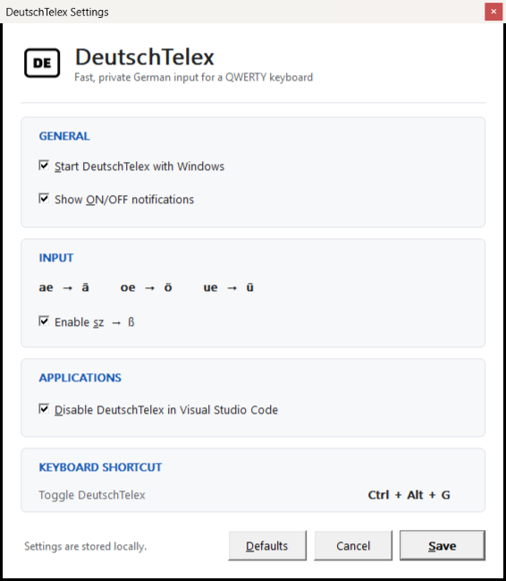

# DeutschTelex

DeutschTelex is a lightweight, UniKey-inspired German Telex input method for
Windows 10 and 11. It provides deterministic system-wide input conversion for
QWERTY keyboards using a native Win32 tray application.

## Features

- `ae → ä`, `oe → ö`, `ue → ü`, and optional `sz → ß`
- UniKey-style third-character escape behavior
- Single-typo plus Backspace recovery
- System-wide ON/OFF control from the notification area
- Global `Ctrl+Alt+G` toggle
- Optional Start with Windows
- Optional Visual Studio Code exclusion
- Same-window mouse/caret safety reset
- Local-only processing with no telemetry or typed-text logging

## Settings interface



## Typing rules

| Input | Output |
|---|---|
| `ae` | `ä` |
| `aee` | `ae` |
| `oe` | `ö` |
| `oee` | `oe` |
| `ue` | `ü` |
| `uee` | `ue` |
| `Ae` | `Ä` |
| `Oe` | `Ö` |
| `Ue` | `Ü` |
| `sz` | `ß` |
| `szz` | `sz` |

`ss` remains unchanged. Unsupported mixed or all-uppercase forms such as `AE`,
`aE`, `SZ`, and `Sz` also remain unchanged.

## Typo correction

DeutschTelex supports one safe accidental-character correction. For example:

```text
a
w
Backspace
e
```

The visible result is `ä`. Deleting the one accidental printable character
restores the pending Telex prefix without reading the target application's text.

Clicking or scrolling resets pending transformation and typo-checkpoint state.
This prevents a prefix typed at one caret location from modifying unrelated text
after the caret is moved within the same application. Mouse coordinates and
mouse-event history are never retained.

## Installation

When an installer artifact is available, run
`DeutschTelex-0.8.0-win64-setup.exe`. It installs per user under
`%LOCALAPPDATA%\Programs\DeutschTelex`, creates a Start Menu shortcut, and does
not require administrator privileges. Start with Windows is not enabled by the
installer; control it from DeutschTelex Settings.

DeutschTelex 0.8.0 beta artifacts are unsigned. Windows SmartScreen may
warn about an unknown publisher. Do not disable Windows security globally; only
continue if the artifact came from a source you trust.

## Portable version

Extract `DeutschTelex-0.8.0-win64-portable.zip`, then run `DeutschTelex.exe`.
Portable use still stores preferences in
`%LOCALAPPDATA%\DeutschTelex\settings.ini`.

If Start with Windows is enabled and the portable executable is later moved or
deleted, its startup entry can point to the old location. Disable Start with
Windows before moving it, then re-enable it from the new location.

## Usage

DeutschTelex starts in the notification area and defaults to ON. Left-click the
tray icon to open Settings. Right-click it for ON/OFF, Settings, About, and Exit.
Press `Ctrl+Alt+G` to toggle globally.

## Settings

- Start DeutschTelex with Windows
- Show ON/OFF notifications
- Enable or disable `sz → ß`
- Disable DeutschTelex in Visual Studio Code

## Privacy

Keyboard processing happens locally. DeutschTelex does not log or transmit typed
text and includes no telemetry, analytics, networking, update checks, clipboard
inspection, or target-document inspection. It keeps only the minimum temporary
finite-state-machine state required for input conversion.

When the optional VS Code exclusion is enabled, DeutschTelex temporarily checks
the foreground process executable name. It does not inspect editor content,
document filenames, workspaces, or application text and does not retain an
application history.

## Known limitations

- This is an unsigned pre-1.0 development release.
- Elevated applications may not accept input from a non-elevated process.
- Secure Windows desktops are outside the reach of a normal desktop hook.
- Some games, unusual terminals, remote desktop environments, or applications
  that reject injected Unicode may not behave as expected.
- The optional application exclusion recognizes Visual Studio Code only.
- Portable Start with Windows registration does not follow a moved executable.

## Building from source

Requirements:

- Windows 10 or 11 x64
- CMake 3.20 or newer
- A C++20 compiler
- Ninja or another CMake-supported build tool

MinGW/GCC 15.2.0 is currently verified. MSVC warning configuration is present,
but this release has not been verified with MSVC. Interactive application and
Windows-version results are tracked in
[docs/compatibility.md](docs/compatibility.md); untested targets are not claimed
as compatible.

```powershell
cmake -S . -B build -G Ninja -DBUILD_TESTING=ON -DCMAKE_BUILD_TYPE=Release
cmake --build build --parallel
ctest --test-dir build --output-on-failure
```

For portable release creation, see [docs/release-build.md](docs/release-build.md).

## License

DeutschTelex is released under the [MIT License](LICENSE).
